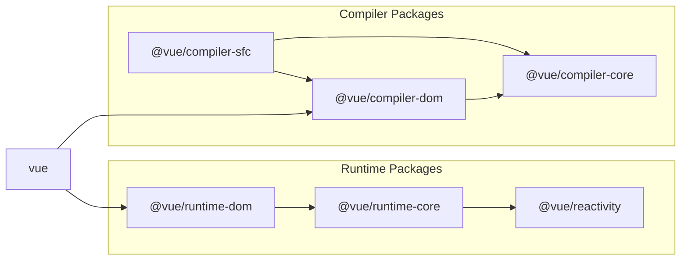

# 构成 Vue.js 的关键要素

## Vue.js 仓库

Vue.js 可以在这个仓库中找到：  
https://github.com/vuejs/core

有趣的是，这是 v3 的仓库．对于 v2 和更早的版本，您可以在另一个仓库中找到：  
https://github.com/vuejs/vue

为了本次讨论，我们将专注于核心仓库（v3）．

## 构成 Vue.js 的主要要素

让我们首先对 Vue.js 的实现有一个整体的理解．\
Vue.js 仓库中有一个关于贡献的 markdown 文件；  
如果您感兴趣，可以查看它以了解其架构．（不过，跳过也没关系．）

https://github.com/vuejs/core/blob/main/.github/contributing.md

从大的方面来说，Vue.js 包含以下主要组件：

## 运行时（Runtime）

运行时包含影响实际操作的所有内容 - 从渲染到组件状态管理．\
这指的是在浏览器或服务器（在 SSR 的情况下）上运行的用 Vue.js 开发的 Web 应用程序的全部内容．具体包括：

### 组件系统

Vue.js 是一个面向组件的框架．根据用户的需求，您可以可维护地创建和封装组件以供重用．\
它还提供组件之间状态共享（props/emits 或 provide/inject）和生命周期钩子等功能．

### 响应式系统

它跟踪组件持有的状态，并在发生变化时更新屏幕．\
这种监控和响应机制称为响应式．

```ts
import { ref } from 'vue'

const count = ref(0)

// 当执行这个函数时，显示计数的屏幕也会更新
const increment = () => {
  count.value++
}
```

（仅仅通过改变一个值就能更新屏幕，这很神奇，对吧？）

### 虚拟 DOM 系统

虚拟 DOM 系统是 Vue.js 的另一个强大机制．它定义了一个模仿 DOM 的 JavaScript 对象在 JS 运行时中．\
更新时，它将当前的虚拟 DOM 与新的虚拟 DOM 进行比较，并仅将差异反映到真实 DOM 中．\
我们将在专门的章节中深入探讨这一点．

## 编译器（Compiler）

编译器负责将开发者接口转换为内部实现．\
"开发者接口"是指"使用 Vue.js 进行 Web 应用程序开发的开发者"和"Vue 内部操作"之间的边界．\
本质上，当您使用 Vue.js 编写时，有些部分显然不是纯 JavaScript - 比如模板指令或单文件组件．\
Vue.js 提供这些语法并将它们转换为纯 JavaScript．\
此功能仅在开发阶段使用，不是实际运行的 Web 应用程序的一部分．\
（它仅仅编译为 JavaScript 代码）．

编译器有两个主要部分：

### 模板编译器

顾名思义，这是模板部分的编译器．\
具体来说，它处理 v-if 或 v-on 等指令，用户组件标记（如 <Counter />）以及插槽等功能．

### SFC 编译器

正如您可能猜到的，这代表单文件组件编译器．\
它允许您在单个 .vue 文件中定义组件的模板，脚本和样式．\
在 script setup 中使用的函数，如 [defineProps 或 defineEmits](https://cn.vuejs.org/api/sfc-script-setup#defineprops-defineemits) 也由此编译器提供．\
这个 SFC 编译器通常与 Webpack 或 Vite 等工具结合使用．\
作为其他工具插件的实现不在核心仓库中．\
SFC 编译器的主要功能在核心中，但插件在不同的仓库中实现．\
（参考：[vitejs/vite-plugin-vue](https://github.com/vitejs/vite-plugin-vue)）

顺便说一下，我们将实现一个实际的 Vite 插件来操作我们的自定义 SFC 编译器．

## 窥探 vuejs/core 目录

现在我们对 Vue 的主要要素有了大致的了解，让我们看看实际的源代码是什么样子的（尽管我们只是在讨论目录）．\
主要源代码存储在"packages"目录中．

https://github.com/vuejs/core/tree/main/packages

一些需要关注的关键目录是：

- compiler-core
- compiler-dom
- compiler-sfc
- reactivity
- runtime-core
- runtime-dom
- vue

为了理解它们的相互依赖关系，贡献指南中的图表特别有见地．



https://github.com/vuejs/core/blob/main/.github/contributing.md#package-dependencies

<br/>
在这本书中，我们将为所有这些主题提供实现和解释。
