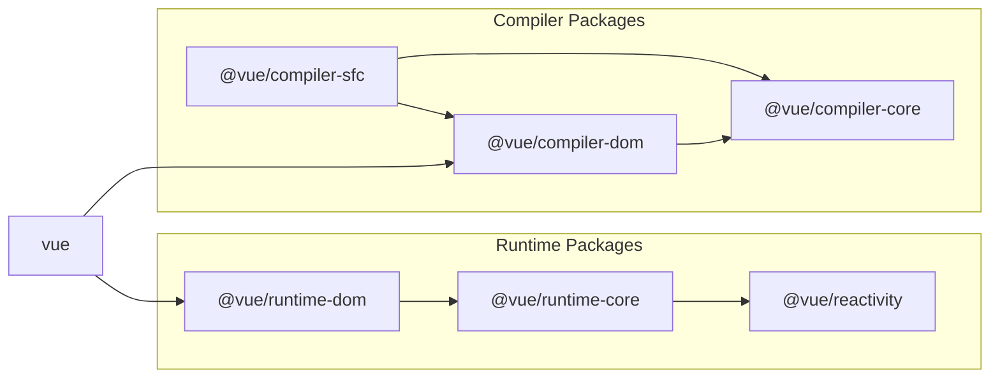

# 实现模板编译器

## 实现方法

基本方法是操作通过 template 选项传递的字符串来生成特定函数。\
让我们将编译器分为三个元素。

### 解析

解析涉及从给定字符串中提取必要信息。您可以这样想：

```ts
const { tag, props, textContent } = parse(`<p class="hello">Hello World</p>`)
console.log(tag) // "p"
console.log(prop) // { class: "hello" }
console.log(textContent) // "Hello World"
```

### 代码生成

代码生成基于解析结果生成代码（字符串）。

```ts
const code = codegen({ tag, props, textContent })
console.log(code) // "h('p', { class: 'hello' }, ['Hello World']);"
```

### 函数对象生成

函数对象生成基于 codegen 生成的代码（字符串）创建可执行函数。\
在 JavaScript 中，您可以使用 Function 构造函数从字符串生成函数。

```ts
const f = new Function('return 1')
console.log(f()) // 1

// 如果您想定义参数，可以这样做
const add = new Function('a', 'b', 'return a + b')
console.log(add(1, 1)) // 2
```

我们将使用这个来生成函数。\
这里需要注意的一点是，生成的函数只能处理在其内部定义的变量，所以我们需要在其中包含 h 函数等函数的导入。

```ts
import * as runtimeDom from './runtime-dom'
const render = new Function('ChibiVue', code)(runtimeDom)
```

通过这样做，我们可以将 runtimeDom 作为 ChibiVue 接收，并在 codegen 阶段包含 h 函数，如下所示：

```ts
const code = codegen({ tag, props, textContent })
console.log(code) // "return () => { const { h } = ChibiVue; return h('p', { class: 'hello' }, ['Hello World']); }"
```

换句话说，之前我们说我们会这样转换：

```ts
;`<p class="hello">Hello World</p>`
// ↓
h('p', { class: 'hello' }, ['Hello World'])
```

但准确地说，我们这样转换：

```ts
;`<p class="hello">Hello World</p>`

// ↓

ChibiVue => {
  return () => {
    const { h } = ChibiVue
    return h('p', { class: 'hello' }, ['Hello World'])
  }
}
```

并传递 runtimeDom 来生成 render 函数。\
codegen 的责任是生成以下字符串：

```ts
const code = `
  return () => {
      const { h } = ChibiVue;
      return h("p", { class: "hello" }, ["Hello World"]);
  };
`
```

## 实现

一旦您理解了方法，让我们实现它。\
在 `~/packages` 中创建一个名为 `compiler-core` 的目录，并在其中创建 `index.ts`、`parse.ts` 和 `codegen.ts`。

```sh
pwd # ~/
mkdir packages/compiler-core
touch packages/compiler-core/index.ts
touch packages/compiler-core/parse.ts
touch packages/compiler-core/codegen.ts
```

index.ts 像往常一样只用于导出。

现在让我们从 parse 开始实现。
`packages/compiler-core/parse.ts`

```ts
export const baseParse = (
  content: string,
): { tag: string; props: Record<string, string>; textContent: string } => {
  const matched = content.match(/<(\w+)\s+([^>]*)>([^<]*)<\/\1>/)
  if (!matched) return { tag: '', props: {}, textContent: '' }

  const [_, tag, attrs, textContent] = matched

  const props: Record<string, string> = {}
  attrs.replace(/(\w+)=["']([^"']*)["']/g, (_, key: string, value: string) => {
    props[key] = value
    return ''
  })

  return { tag, props, textContent }
}
```

虽然这是一个使用正则表达式的非常简单的解析器，但对于第一次实现来说已经足够了。

接下来，让我们生成代码。在 codegen.ts 中实现它。\
`packages/compiler-core/codegen.ts`

```ts
export const generate = ({
  tag,
  props,
  textContent,
}: {
  tag: string
  props: Record<string, string>
  textContent: string
}): string => {
  return `return () => {
  const { h } = ChibiVue;
  return h("${tag}", { ${Object.entries(props)
    .map(([k, v]) => `${k}: "${v}"`)
    .join(', ')} }, ["${textContent}"]);
}`
}
```

现在，让我们实现一个通过组合这些从模板生成函数字符串的函数。\
创建一个名为 `packages/compiler-core/compile.ts` 的新文件。

`packages/compiler-core/compile.ts`

```ts
import { generate } from './codegen'
import { baseParse } from './parse'

export function baseCompile(template: string) {
  const parseResult = baseParse(template)
  const code = generate(parseResult)
  return code
}
```

这应该不会太困难。实际上，`compiler-core` 的责任到此结束。

## 运行时编译器和构建过程编译器

实际上，Vue 有两种类型的编译器。\
一种是在运行时（在浏览器中）运行的编译器，另一种是在构建过程中（如 Node.js）运行的编译器。\
具体来说，运行时编译器负责编译 template 选项或作为 HTML 提供的模板，而构建过程编译器负责编译 SFC（或 JSX）。\
我们当前实现的 template 选项属于前者。

```ts
const app = createApp({ template: `<p class="hello">Hello World</p>` })
app.mount('#app')
```

```html
<div id="app"></div>
```

作为 HTML 提供的模板是一个开发者接口，您可以在 HTML 中编写 Vue 模板。\
（通过 CDN 等快速将其合并到 HTML 中很方便。）

```ts
const app = createApp()
app.mount('#app')
```

```html
<div id="app">
  <p class="hello">Hello World</p>
  <button @click="() => alert('hello')">click me!</button>
</div>
```

这两种都需要编译，但编译是在浏览器中执行的。

另一方面，SFC 编译在项目构建期间执行，运行时只存在编译后的代码。\
（您需要在开发环境中设置 Vite 或 webpack 等打包器。）

```vue
<!-- App.vue -->
<script>
export default {}
</script>

<template>
  <p class="hello">Hello World</p>
  <button @click="() => alert("hello")">click me!</button>
</template>
```

```ts
import App from 'App.vue'
const app = createApp(App)
app.mount('#app')
```

```html
<div id="app"></div>
```

需要注意的重要一点是，两个编译器共享公共处理。\
这个公共部分的源代码在 `compiler-core` 目录中实现。\
运行时编译器和 SFC 编译器分别在 `compiler-dom` 和 `compiler-sfc` 目录中实现。\
请再次查看这个图表。



https://github.com/vuejs/core/blob/main/.github/contributing.md#package-dependencies

## 继续实现

我们跳得有点快，但让我们继续实现。\
虽然我想实现 `packages/index.ts`，但有一些准备工作要做，所以让我们先做那个。\
准备工作是在 `packages/runtime-core/component.ts` 中实现一个变量来保存编译器本身，以及一个注册函数。

`packages/runtime-core/component.ts`

```ts
type CompileFunction = (template: string) => InternalRenderFunction
let compile: CompileFunction | undefined

export function registerRuntimeCompiler(_compile: any) {
  compile = _compile
}
```

现在，让我们在 `packages/index.ts` 中生成函数并注册它。

```ts
import { compile } from './compiler-dom'
import { InternalRenderFunction, registerRuntimeCompiler } from './runtime-core'
import * as runtimeDom from './runtime-dom'

function compileToFunction(template: string): InternalRenderFunction {
  const code = compile(template)
  return new Function('ChibiVue', code)(runtimeDom)
}

registerRuntimeCompiler(compileToFunction)

export * from './runtime-core'
export * from './runtime-dom'
export * from './reactivity'
```

※ 不要忘记从 `runtime-dom` 导出 `h` 函数，因为它需要包含在 `runtimeDom` 中。

```ts
export { h } from '../runtime-core'
```

现在编译器已注册，让我们实际执行编译。\
由于组件选项类型中需要模板，让我们现在添加模板。

```ts
export type ComponentOptions = {
  props?: Record<string, any>
  setup?: (
    props: Record<string, any>,
    ctx: { emit: (event: string, ...args: any[]) => void },
  ) => Function
  render?: Function
  template?: string // 添加
}
```

现在，让我们编译重要部分。

```ts
const mountComponent = (initialVNode: VNode, container: RendererElement) => {
  const instance: ComponentInternalInstance = (initialVNode.component =
    createComponentInstance(initialVNode))

  // ----------------------- 从这里
  const { props } = instance.vnode
  initProps(instance, props)
  const component = initialVNode.type as Component
  if (component.setup) {
    instance.render = component.setup(instance.props, {
      emit: instance.emit,
    }) as InternalRenderFunction
  }
  // ----------------------- 到这里

  setupRenderEffect(instance, initialVNode, container)
}
```

我们将在 `packages/runtime-core/component.ts` 中提取上述部分。

`packages/runtime-core/component.ts`

```ts
export const setupComponent = (instance: ComponentInternalInstance) => {
  const { props } = instance.vnode
  initProps(instance, props)

  const component = instance.type as Component
  if (component.setup) {
    instance.render = component.setup(instance.props, {
      emit: instance.emit,
    }) as InternalRenderFunction
  }
}
```

`packages/runtime-core/renderer.ts`

```ts
const mountComponent = (initialVNode: VNode, container: RendererElement) => {
  // prettier-ignore
  const instance: ComponentInternalInstance = (initialVNode.component = createComponentInstance(initialVNode));
  setupComponent(instance)
  setupRenderEffect(instance, initialVNode, container)
}
```

现在，让我们在 `setupComponent` 函数内部执行编译。

```ts
export const setupComponent = (instance: ComponentInternalInstance) => {
  const { props } = instance.vnode
  initProps(instance, props)

  const component = instance.type as Component
  if (component.setup) {
    instance.render = component.setup(instance.props, {
      emit: instance.emit,
    }) as InternalRenderFunction
  }

  // ------------------------ 这里
  if (compile && !component.render) {
    const template = component.template ?? ''
    if (template) {
      instance.render = compile(template)
    }
  }
}
```

现在，我们应该能够使用 `template` 选项编译简单的 HTML。\
让我们在游乐场中试试！

```ts
const app = createApp({ template: `<p class="hello">Hello World</p>` })
app.mount('#app')
```


看起来工作正常。\
让我们尝试做一些更改，看看它们是否得到反映。

```ts
const app = createApp({
  template: `<b class="hello" style="color: red;">Hello World!!</b>`,
})
app.mount('#app')
```


看起来实现正确！

到此为止的源代码：
[chibivue (GitHub)](https://github.com/chibivue-land/chibivue/tree/main/book/impls/10_minimum_example/060_template_compiler)
