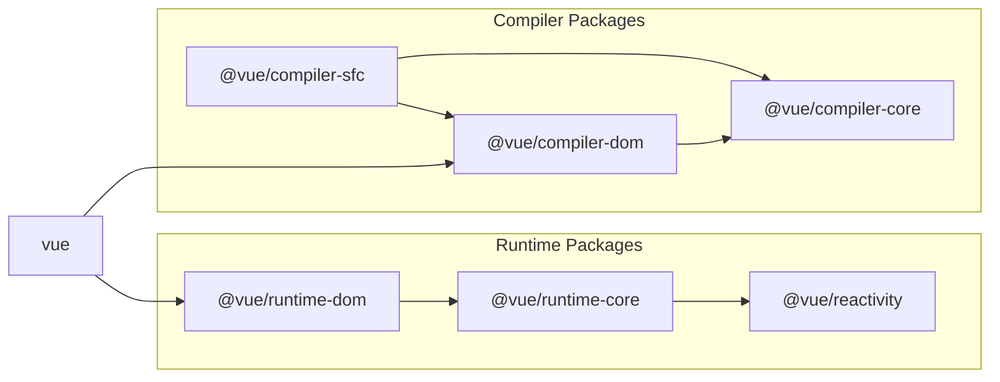

# 实现 SFC 解析器

## 准备工作

虽然这是我们之前创建的示例插件，但让我们删除它，因为它不再需要了。

```sh
pwd # ~
rm -rf ./plugin-sample
```

另外，为了创建 Vite 插件，请安装主要的 Vite 包。

```sh
pwd # ~
ni vite
```

这是插件的主要部分，但由于这原本超出了 vuejs/core 的范围，我们将在 `packages` 目录中创建一个名为 `@extensions` 的目录并在那里实现它。

```sh
pwd # ~
mkdir -p packages/@extensions/vite-plugin-chibivue
touch packages/@extensions/vite-plugin-chibivue/index.ts
```

`~/packages/@extensions/vite-plugin-chibivue/index.ts`

```ts
import type { Plugin } from 'vite'

export default function vitePluginChibivue(): Plugin {
  return {
    name: 'vite:chibivue',

    transform(code, id) {
      return { code }
    },
  }
}
```

现在，让我们实现 SFC 编译器。\
但是，没有任何实质内容可能很难想象，所以让我们实现一个游乐场并在运行时进行。\
我们将创建一个简单的 SFC 并加载它。

```sh
pwd # ~
touch examples/playground/src/App.vue
```

`examples/playground/src/App.vue`

```vue
<script>
import { reactive } from 'chibivue'
export default {
  setup() {
    const state = reactive({ message: 'Hello, chibivue!', input: '' })

    const changeMessage = () => {
      state.message += '!'
    }

    const handleInput = e => {
      state.input = e.target?.value ?? ''
    }

    return { state, changeMessage, handleInput }
  },
}
</script>

<template>
  <div class="container" style="text-align: center">
    <h2>{{ state.message }}</h2>
    
    <p><b>chibivue</b> is the minimal Vue.js</p>

    <button @click="changeMessage">click me!</button>

    <br />

    <label>
      Input Data
      <input @input="handleInput" />
    </label>

    <p>input value: {{ state.input }}</p>
  </div>
</template>

<style>
.container {
  height: 100vh;
  padding: 16px;
  background-color: #becdbe;
  color: #2c3e50;
}
</style>
```

`playground/src/main.ts`

```ts
import { createApp } from 'chibivue'
import App from './App.vue'

const app = createApp(App)

app.mount('#app')
```

`playground/vite.config.js`

```ts
import path from 'node:path'
import { fileURLToPath } from 'node:url'
import { defineConfig } from 'vite'

import chibivue from '../../packages/@extensions/vite-plugin-chibivue'

const dirname = path.dirname(fileURLToPath(new URL(import.meta.url)))

export default defineConfig({
  resolve: {
    alias: {
      chibivue: path.resolve(dirname, '../../packages'),
    },
  },
  plugins: [chibivue()],
})
```

让我们尝试在这种状态下启动。


当然，这会导致错误。做得好（？）。

## 解决错误

让我们暂时解决错误。我们不会立即追求完美。\
首先，让我们将 `transform` 的目标限制为 "\*.vue"。\
我们可以像在示例中那样使用 `id` 编写分支语句，但由于 Vite 提供了一个名为 `createFilter` 的函数，让我们使用它创建一个过滤器。\
（这没有特别的原因。）

`~/packages/@extensions/vite-plugin-chibivue/index.ts`

```ts
import type { Plugin } from 'vite'
import { createFilter } from 'vite'

export default function vitePluginChibivue(): Plugin {
  const filter = createFilter(/\.vue$/)

  return {
    name: 'vite:chibivue',

    transform(code, id) {
      if (!filter(id)) return
      return { code: `export default {}` }
    },
  }
}
```

我们创建了一个过滤器，如果是 Vue 文件，则将文件内容转换为 `export default {}`。\
错误应该消失，屏幕应该不显示任何内容。

## 在 compiler-sfc 上实现解析器

现在，这只是一个临时解决方案，所以让我们实现一个合适的解决方案。\
vite-plugin 的作用是使用 Vite 启用转换，所以解析和编译在主 Vue 包中。\
那就是 `compiler-sfc` 目录。



https://github.com/vuejs/core/blob/main/.github/contributing.md#package-dependencies

SFC 编译器对于 Vite 和 Webpack 都是相同的。\
核心实现在 `compiler-sfc` 中。

让我们创建 `compiler-sfc`。

```sh
pwd # ~
mkdir packages/compiler-sfc
touch packages/compiler-sfc/index.ts
```

在 SFC 编译中，SFC 由一个名为 `SFCDescriptor` 的对象表示。

```sh
touch packages/compiler-sfc/parse.ts
```

`packages/compiler-sfc/parse.ts`

```ts
import { SourceLocation } from '../compiler-core'

export interface SFCDescriptor {
  id: string
  filename: string
  source: string
  template: SFCTemplateBlock | null
  script: SFCScriptBlock | null
  styles: SFCStyleBlock[]
}

export interface SFCBlock {
  type: string
  content: string
  loc: SourceLocation
}

export interface SFCTemplateBlock extends SFCBlock {
  type: 'template'
}

export interface SFCScriptBlock extends SFCBlock {
  type: 'script'
}

export declare interface SFCStyleBlock extends SFCBlock {
  type: 'style'
}
```

嗯，没有什么特别困难的。\
它只是一个表示 SFC 信息的对象。

在 `packages/compiler-sfc/parse.ts` 中，我们将把 SFC 文件（字符串）解析为 `SFCDescriptor`。\
你们中的一些人可能在想，"什么？你在模板解析器上如此努力工作，现在你要创建另一个解析器...？这很麻烦。"但不要担心。\
我们在这里要实现的解析器并不是什么大事。那是因为我们只是通过结合我们迄今为止创建的内容来分离模板、脚本和样式。

首先，作为准备，导出我们之前创建的模板解析器。

`~/packages/compiler-dom/index.ts`

```ts
import { baseCompile, baseParse } from '../compiler-core'

export function compile(template: string) {
  return baseCompile(template)
}

// 导出解析器
export function parse(template: string) {
  return baseParse(template)
}
```

在 compiler-sfc 端保留这些接口。

```sh
pwd # ~
touch packages/compiler-sfc/compileTemplate.ts
```

`~/packages/compiler-sfc/compileTemplate.ts`

```ts
import { TemplateChildNode } from '../compiler-core'

export interface TemplateCompiler {
  compile(template: string): string
  parse(template: string): { children: TemplateChildNode[] }
}
```

然后，只需实现解析器。

`packages/compiler-sfc/parse.ts`

```ts
import { ElementNode, NodeTypes, SourceLocation } from '../compiler-core'
import * as CompilerDOM from '../compiler-dom'
import { TemplateCompiler } from './compileTemplate'

export interface SFCParseOptions {
  filename?: string
  sourceRoot?: string
  compiler?: TemplateCompiler
}

export interface SFCParseResult {
  descriptor: SFCDescriptor
}

export const DEFAULT_FILENAME = 'anonymous.vue'

export function parse(
  source: string,
  { filename = DEFAULT_FILENAME, compiler = CompilerDOM }: SFCParseOptions = {},
): SFCParseResult {
  const descriptor: SFCDescriptor = {
    id: undefined!,
    filename,
    source,
    template: null,
    script: null,
    styles: [],
  }

  const ast = compiler.parse(source)
  ast.children.forEach(node => {
    if (node.type !== NodeTypes.ELEMENT) return

    switch (node.tag) {
      case 'template': {
        descriptor.template = createBlock(node, source) as SFCTemplateBlock
        break
      }
      case 'script': {
        const scriptBlock = createBlock(node, source) as SFCScriptBlock
        descriptor.script = scriptBlock
        break
      }
      case 'style': {
        descriptor.styles.push(createBlock(node, source) as SFCStyleBlock)
        break
      }
      default: {
        break
      }
    }
  })

  return { descriptor }
}

function createBlock(node: ElementNode, source: string): SFCBlock {
  const type = node.tag

  let { start, end } = node.loc
  start = node.children[0].loc.start
  end = node.children[node.children.length - 1].loc.end
  const content = source.slice(start.offset, end.offset)

  const loc = { source: content, start, end }
  const block: SFCBlock = { type, content, loc }

  return block
}
```

我认为对于到目前为止已经实现了解析器的每个人来说都很容易。让我们在插件中实际解析 SFC。

`~/packages/@extensions/vite-plugin-chibivue/index.ts`

```ts
import { parse } from '../../compiler-sfc'

export default function vitePluginChibivue(): Plugin {
  //.
  //.
  //.
  return {
    //.
    //.
    //.
    transform(code, id) {
      if (!filter(id)) return
      const { descriptor } = parse(code, { filename: id })
      console.log(
        '🚀 ~ file: index.ts:14 ~ transform ~ descriptor:',
        descriptor,
      )
      return { code: `export default {}` }
    },
  }
}
```

这段代码在 Vite 运行的进程中运行，这意味着它在 Node 中执行，所以我认为控制台输出会显示在终端中。


/_ 为简洁起见省略 _/


看起来解析成功了。做得好！

到此为止的源代码：
[chibivue (GitHub)](https://github.com/chibivue-land/chibivue/tree/main/book/impls/10_minimum_example/070_sfc_compiler2)
