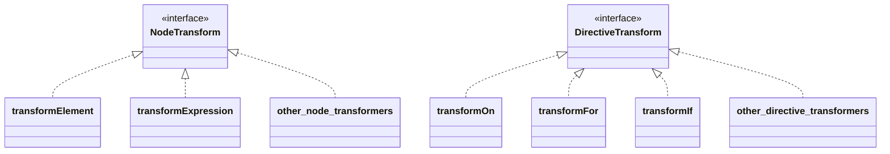

# 转换器和代码生成重构的实现（基础模板编译器部门开始）

## 现有实现的回顾

现在，让我们从最小示例部门停下的地方开始更认真地实现模板编译器。距离我们上次处理它已经有一段时间了，所以让我们回顾一下当前的实现。主要关键词是 Parse、AST 和 Codegen。


```ts
export function baseCompile(
  template: string,
  option: Required<CompilerOptions>,
) {
  const ast = baseParse(template.trim())
  const code = generate(ast, option)
  return code
}
```

实际上，这个配置与原始配置略有不同。让我们看看原始代码。

https://github.com/vuejs/core/blob/37a14a5dae9999bbe684c6de400afc63658ffe90/packages/compiler-core/src/compile.ts#L61

你能理解吗...？

```ts
export function baseCompile(
  template: string,
  option: Required<CompilerOptions>,
) {
  const ast = baseParse(template.trim())
  transform(ast)
  const code = generate(ast, option)
  return code
}
```

就是这样。

这次，我们将实现 `transform` 函数。


## 什么是 Transform？

正如你从上面的代码中可以想象的那样，通过解析获得的 AST 被 `transform` 函数以某种方式转换。

你可以通过阅读这个来了解。  
https://github.com/vuejs/core/blob/37a14a5dae9999bbe684c6de400afc63658ffe90/packages/compiler-core/src/ast.ts#L43C1-L51C23

这个 VNODE_CALL 和以 JS 开头的名称的 AST 代码是我们这次要处理的。
Vue.js 的模板编译器分为两部分：表示解析模板结果的 AST 和表示生成代码的 AST。
我们当前的实现只处理前一个 AST。

让我们考虑将模板 `<p>hello</p>` 作为输入的情况。

首先，通过解析生成以下 AST。这与现有实现相同。

```ts
interface ElementNode {
  tag: string
  props: object /** 省略 */
  children: (ElementNode | TextNode | InterpolationNode)[]
}

interface TextNode {
  content: string
}
```

```json
{
  "tag": "p",
  "props": {},
  "children": [{ "content": "hello" }]
}
```

至于"表示生成代码的 AST"，让我们考虑应该生成什么样的代码。
我认为应该是这样的：

```ts
h('p', {}, ['hello'])
```

这是表示生成的 JavaScript 代码的 AST。
换句话说，它是一个表示用于生成应该生成的代码的 AST 的对象。

```ts
interface VNodeCall {
  tag: string
  props: PropsExpression
  children:
    | TemplateChildNode[] // multiple children
    | TemplateTextChildNode // single text child
    | undefined
}

type PropsExpression = ObjectExpression | CallExpression | ExpressionNode
type TemplateChildNode = ElementNode | InterpolationNode | TextNode
```

```json
{
  "tag": "p",
  "props": {
    "type": "ObjectExpression",
    "properties": []
  },
  "children": { "content": "hello" }
}
```

通过这种方式，表示由 Codegen 生成的代码的 AST 被表达。
你可能在这一点上感觉不到分离它们的必要性，但在将来实现指令时会很有用。
通过分离专注于输入的 AST 和专注于输出的 AST，我们可以使用称为 `transform` 的函数执行从 `input AST -> output AST` 的转换。

## Codegen 节点

现在我们已经掌握了流程，让我们确认我们将处理什么样的节点（我们想要转换什么样的节点）。我将在枚举它们并提供注释的同时进行解释。请参考源代码获取准确信息，因为某些部分被省略了。

```ts
export interface SimpleExpressionNode extends Node {
  type: NodeTypes.SIMPLE_EXPRESSION
  content: string
  isStatic: boolean
  identifiers?: string[]
}

// 这表示调用 h 函数的表达式。
// 它假设类似 `h("p", { class: 'message'}, ["hello"])` 的东西。
export interface VNodeCall extends Node {
  type: NodeTypes.VNODE_CALL
  tag: string | symbol
  props: ObjectExpression | undefined // 注意：在源代码中实现为 PropsExpression（用于未来扩展）
  children:
    | TemplateChildNode[] // multiple children
    | TemplateTextChildNode
    | undefined
}

export type JSChildNode =
  | VNodeCall
  | ObjectExpression
  | ArrayExpression
  | ExpressionNode

// 这表示一个 JavaScript 对象。它用于 VNodeCall 的 props 等。
export interface ObjectExpression extends Node {
  type: NodeTypes.JS_OBJECT_EXPRESSION
  properties: Array<Property>
}
export interface Property extends Node {
  type: NodeTypes.JS_PROPERTY
  key: ExpressionNode
  value: JSChildNode
}

// 这表示一个 JavaScript 数组。它用于 VNodeCall 的 children 等。
export interface ArrayExpression extends Node {
  type: NodeTypes.JS_ARRAY_EXPRESSION
  elements: Array<string | Node>
}
```

## 转换器设计

在实现转换器之前，让我们谈谈设计。首先，重要的是要注意有两种类型的转换器：NodeTransform 和 DirectiveTransform。这些分别用于转换节点和指令，并采用以下接口。

```ts
export type NodeTransform = (
  node: RootNode | TemplateChildNode,
  context: TransformContext,
) => void | (() => void) | (() => void)[]

// TODO:
// export type DirectiveTransform = (
//   dir: DirectiveNode,
//   node: ElementNode,
//   context: TransformContext,
// ) => DirectiveTransformResult;
export type DirectiveTransform = Function
```

DirectiveTransform 将在实现指令时在后面的章节中介绍，所以现在让我们称之为 Function。
NodeTransform 和 DirectiveTransform 实际上都是函数。你可以将它们视为转换 AST 的函数。
请注意，NodeTransform 的结果是一个函数。在实现 transform 时，如果你实现它返回一个函数，该函数将在该节点的转换之后执行（它被称为 onExit 过程）。
你想在节点的 transform 之后执行的任何处理都应该在这里描述。我将在稍后描述称为 traverseNode 的函数时解释这一点。
接口的解释主要如上所述。

作为更具体的实现，有用于转换元素的 transformElement 和用于转换表达式的 transformExpression 等。
至于 DirectiveTransform 的实现，每个指令都有实现。
这些实现在 compiler-core/src/transforms 中实现。具体的转换过程在这里实现。

https://github.com/vuejs/core/tree/37a14a5dae9999bbe684c6de400afc63658ffe90/packages/compiler-core/src/transforms

图像 ↓



接下来，关于上下文，TransformContext 保存在这些转换期间使用的信息和函数。
将来会添加更多，但现在这就足够了。

```ts
export interface TransformContext extends Required<TransformOptions> {
  currentNode: RootNode | TemplateChildNode | null
  parent: ParentNode | null
  childIndex: number
}
```

## 转换器的实现

现在让我们在实践中看看 transform 函数。首先，让我们从独立于每个转换过程内容的框架的一般解释开始。

结构非常简单，只需生成上下文并使用 traverseNode 函数遍历节点。
这个 traverseNode 函数是转换的主要实现。

```ts
export function transform(root: RootNode, options: TransformOptions) {
  const context = createTransformContext(root, options)
  traverseNode(root, context)
}
```

在 traverseNode 中，基本上，它只是将保存在上下文中的 nodeTransforms（转换节点的函数集合）应用于节点。
对于那些有子节点的，子节点也通过 traverseNode 传递。
在接口解释期间提到的 onExit 的实现也在这里。

```ts
export function traverseNode(
  node: RootNode | TemplateChildNode,
  context: TransformContext,
) {
  context.currentNode = node

  const { nodeTransforms } = context
  const exitFns = [] // 转换后要执行的操作
  for (let i = 0; i < nodeTransforms.length; i++) {
    const onExit = nodeTransforms[i](node, context)

    // 注册转换后要执行的操作
    if (onExit) {
      if (isArray(onExit)) {
        exitFns.push(...onExit)
      } else {
        exitFns.push(onExit)
      }
    }
    if (!context.currentNode) {
      return
    } else {
      node = context.currentNode
    }
  }

  switch (node.type) {
    case NodeTypes.INTERPOLATION:
      break
    case NodeTypes.ELEMENT:
    case NodeTypes.ROOT:
      traverseChildren(node, context)
      break
  }

  context.currentNode = node

  // 执行转换后要执行的操作
  let i = exitFns.length
  while (i--) {
    exitFns[i]() // 可以假设转换已完成而执行的操作
  }
}

export function traverseChildren(
  parent: ParentNode,
  context: TransformContext,
) {
  for (let i = 0; i < parent.children.length; i++) {
    const child = parent.children[i]
    if (isString(child)) continue
    context.parent = parent
    context.childIndex = i
    traverseNode(child, context)
  }
}
```

接下来，让我们谈谈具体的转换过程。作为示例，让我们实现 transformElement。

在 transformElement 中，我们主要将类型为 NodeTypes.ELEMENT 的节点转换为 VNodeCall。

```ts
export interface ElementNode extends Node {
  type: NodeTypes.ELEMENT
  tag: string
  props: Array<AttributeNode | DirectiveNode>
  children: TemplateChildNode[]
  isSelfClosing: boolean
  codegenNode: VNodeCall | SimpleExpressionNode | undefined
}

// ↓↓↓↓↓↓ 转换 ↓↓↓↓↓↓ //

export interface VNodeCall extends Node {
  type: NodeTypes.VNODE_CALL
  tag: string | symbol
  props: PropsExpression | undefined
  children:
    | TemplateChildNode[] // multiple children
    | TemplateTextChildNode
    | undefined
}
```

这是一个简单的对象到对象的转换，所以我认为不会很困难。让我们尝试通过阅读源代码来实现它。
我将粘贴我这次假设的代码以防万一。（指令支持将在另一章中完成。）

```ts
export const transformElement: NodeTransform = (node, context) => {
  return function postTransformElement() {
    node = context.currentNode!

    if (node.type !== NodeTypes.ELEMENT) return

    const { tag, props } = node

    const vnodeTag = `"${tag}"`
    let vnodeProps: VNodeCall['props']
    let vnodeChildren: VNodeCall['children']

    // props
    if (props.length > 0) {
      const propsBuildResult = buildProps(node)
      vnodeProps = propsBuildResult.props
    }

    // children
    if (node.children.length > 0) {
      if (node.children.length === 1) {
        const child = node.children[0]
        const type = child.type
        const hasDynamicTextChild = type === NodeTypes.INTERPOLATION

        if (hasDynamicTextChild || type === NodeTypes.TEXT) {
          vnodeChildren = child as TemplateTextChildNode
        } else {
          vnodeChildren = node.children
        }
      } else {
        vnodeChildren = node.children
      }
    }

    node.codegenNode = createVNodeCall(vnodeTag, vnodeProps, vnodeChildren)
  }
}

export function buildProps(node: ElementNode): {
  props: PropsExpression | undefined
  directives: DirectiveNode[]
} {
  const { props } = node
  let properties: ObjectExpression['properties'] = []
  const runtimeDirectives: DirectiveNode[] = []

  for (let i = 0; i < props.length; i++) {
    const prop = props[i]
    if (prop.type === NodeTypes.ATTRIBUTE) {
      const { name, value } = prop

      properties.push(
        createObjectProperty(
          createSimpleExpression(name, true),
          createSimpleExpression(value ? value.content : '', true),
        ),
      )
    } else {
      // directives
      // TODO:
    }
  }

  let propsExpression: PropsExpression | undefined = undefined
  if (properties.length) {
    propsExpression = createObjectExpression(properties)
  }

  return {
    props: propsExpression,
    directives: runtimeDirectives,
  }
}
```

## 基于转换后的 AST 的代码生成

由于我们为 Codegen 转换了 AST，我们也需要支持 Codegen。
对于进入 Codegen 的 AST，假设 VNodeClass（以及它们拥有的节点）编写代码就足够了。
期望的最终字符串表示与以前相同。

现有的 Codegen 实现非常简单，所以让我们在这里使它更正式一些（因为它相当硬编码）。
让我们也创建一个 Codegen 特定的上下文并将生成的代码推送到其中。
此外，让我们在上下文中实现一些辅助函数（如缩进）。

```ts
export interface CodegenContext {
  source: string
  code: string
  indentLevel: number
  line: 1
  column: 1
  offset: 0
  push(code: string, node?: CodegenNode): void
  indent(): void
  deindent(withoutNewLine?: boolean): void
  newline(): void
}
```

我将在这里省略实现细节，但我只是为每个角色分离了函数，实现方法没有重大变化。
由于我还没有能够支持指令，由于在该区域删除了临时实现，有些部分不工作，但
如果代码大致按以下方式工作，就可以了！

```ts
import { createApp, defineComponent, ref } from 'chibivue'

const App = defineComponent({
  setup() {
    const count = ref(0)
    return { count }
  },

  template: `
    <div class="container">
      <p> Hello World! </p>
      <p> Count: {{ count }} </p>
    </div>
  `,
})

const app = createApp(App)

app.mount('#app')
```

到此为止的源代码：
[chibivue (GitHub)](https://github.com/chibivue-land/chibivue/tree/main/book/impls/50_basic_template_compiler/010_transformer)
