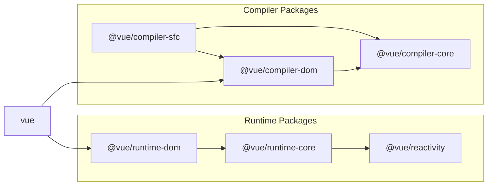

# 構成 Vue.js 的關鍵要素

## Vue.js 倉庫

Vue.js 可以在這個倉庫中找到：  
https://github.com/vuejs/core

有趣的是，這是 v3 的倉庫．對於 v2 和更早的版本，您可以在另一個倉庫中找到：  
https://github.com/vuejs/vue

為了本次討論，我們將專注於核心倉庫（v3）．

## 構成 Vue.js 的主要要素

讓我們首先對 Vue.js 的實現有一個整體的理解．\
Vue.js 倉庫中有一個關於貢獻的 markdown 文件；  
如果您感興趣，可以查看它以了解其架構．（不過，跳過也沒關係．）

https://github.com/vuejs/core/blob/main/.github/contributing.md

從大的方面來說，Vue.js 包含以下主要組件：

## 運行時（Runtime）

運行時包含影響實際操作的所有內容 - 從渲染到組件狀態管理．\
這指的是在瀏覽器或伺服器（在 SSR 的情況下）上運行的用 Vue.js 開發的 Web 應用程式的全部內容．具體包括：

### 組件系統

Vue.js 是一個面向組件的框架．根據用戶的需求，您可以可維護地創建和封裝組件以供重用．\
它還提供組件之間狀態共享（props/emits 或 provide/inject）和生命週期鉤子等功能．

### 響應式系統

它跟蹤組件持有的狀態，並在發生變化時更新螢幕．\
這種監控和響應機制稱為響應式．

```ts
import { ref } from 'vue'

const count = ref(0)

// 當執行這個函數時，顯示計數的螢幕也會更新
const increment = () => {
  count.value++
}
```

（僅僅通過改變一個值就能更新螢幕，這很神奇，對吧？）

### 虛擬 DOM 系統

虛擬 DOM 系統是 Vue.js 的另一個強大機制．它定義了一個模仿 DOM 的 JavaScript 對象在 JS 運行時中．\
更新時，它將當前的虛擬 DOM 與新的虛擬 DOM 進行比較，並僅將差異反映到真實 DOM 中．\
我們將在專門的章節中深入探討這一點．

## 編譯器（Compiler）

編譯器負責將開發者介面轉換為內部實現．\
「開發者介面」是指「使用 Vue.js 進行 Web 應用程式開發的開發者」和「Vue 內部操作」之間的邊界．\
本質上，當您使用 Vue.js 編寫時，有些部分顯然不是純 JavaScript - 比如模板指令或單文件組件．\
Vue.js 提供這些語法並將它們轉換為純 JavaScript．\
此功能僅在開發階段使用，不是實際運行的 Web 應用程式的一部分．\
（它僅僅編譯為 JavaScript 代碼）．

編譯器有兩個主要部分：

### 模板編譯器

顧名思義，這是模板部分的編譯器．\
具體來說，它處理 v-if 或 v-on 等指令，用戶組件標記（如 <Counter />）以及插槽等功能．

### SFC 編譯器

正如您可能猜到的，這代表單文件組件編譯器．\
它允許您在單個 .vue 文件中定義組件的模板，腳本和樣式．\
在 script setup 中使用的函數，如 [defineProps 或 defineEmits](https://cn.vuejs.org/api/sfc-script-setup#defineprops-defineemits) 也由此編譯器提供．\
這個 SFC 編譯器通常與 Webpack 或 Vite 等工具結合使用．\
作為其他工具插件的實現不在核心倉庫中．\
SFC 編譯器的主要功能在核心中，但插件在不同的倉庫中實現．\
（參考：[vitejs/vite-plugin-vue](https://github.com/vitejs/vite-plugin-vue)）

順便說一下，我們將實現一個實際的 Vite 插件來操作我們的自定義 SFC 編譯器．

## 窺探 vuejs/core 目錄

現在我們對 Vue 的主要要素有了大致的了解，讓我們看看實際的源代碼是什麼樣子的（儘管我們只是在討論目錄）．\
主要源代碼存儲在「packages」目錄中．

https://github.com/vuejs/core/tree/main/packages

一些需要關注的關鍵目錄是：

- compiler-core
- compiler-dom
- compiler-sfc
- reactivity
- runtime-core
- runtime-dom
- vue

為了理解它們的相互依賴關係，貢獻指南中的圖表特別有見地．



https://github.com/vuejs/core/blob/main/.github/contributing.md#package-dependencies

<br/>
在這本書中，我們將為所有這些主題提供實現和解釋。
