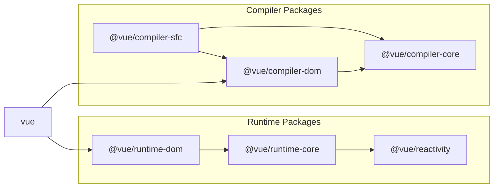

# 實現模板編譯器

## 實現方法

基本方法是操作通過 template 選項傳遞的字串來生成特定函式．\
讓我們將編譯器分為三個元素．

### 解析

解析涉及從給定字串中提取必要資訊．您可以這樣想：

```ts
const { tag, props, textContent } = parse(`<p class="hello">Hello World</p>`)
console.log(tag) // "p"
console.log(prop) // { class: "hello" }
console.log(textContent) // "Hello World"
```

### 程式碼生成

程式碼生成基於解析結果生成程式碼（字串）．

```ts
const code = codegen({ tag, props, textContent })
console.log(code) // "h('p', { class: 'hello' }, ['Hello World']);"
```

### 函式物件生成

函式物件生成基於 codegen 生成的程式碼（字串）創建可執行函式．\
在 JavaScript 中，您可以使用 Function 建構函式從字串生成函式．

```ts
const f = new Function('return 1')
console.log(f()) // 1

// 如果您想定義參數，可以這樣做
const add = new Function('a', 'b', 'return a + b')
console.log(add(1, 1)) // 2
```

我們將使用這個來生成函式．\
這裡需要注意的一點是，生成的函式只能處理在其內部定義的變數，所以我們需要在其中包含 h 函式等函式的匯入．

```ts
import * as runtimeDom from './runtime-dom'
const render = new Function('ChibiVue', code)(runtimeDom)
```

通過這樣做，我們可以將 runtimeDom 作為 ChibiVue 接收，並在 codegen 階段包含 h 函式，如下所示：

```ts
const code = codegen({ tag, props, textContent })
console.log(code) // "return () => { const { h } = ChibiVue; return h('p', { class: 'hello' }, ['Hello World']); }"
```

換句話說，之前我們說我們會這樣轉換：

```ts
;`<p class="hello">Hello World</p>`
// ↓
h('p', { class: 'hello' }, ['Hello World'])
```

但準確地說，我們這樣轉換：

```ts
;`<p class="hello">Hello World</p>`

// ↓

ChibiVue => {
  return () => {
    const { h } = ChibiVue
    return h('p', { class: 'hello' }, ['Hello World'])
  }
}
```

並傳遞 runtimeDom 來生成 render 函式．\
codegen 的責任是生成以下字串：

```ts
const code = `
  return () => {
      const { h } = ChibiVue;
      return h("p", { class: "hello" }, ["Hello World"]);
  };
`
```

## 實現

一旦您理解了方法，讓我們實現它．\
在 `~/packages` 中創建一個名為 `compiler-core` 的目錄，並在其中創建 `index.ts`，`parse.ts` 和 `codegen.ts`．

```sh
pwd # ~/
mkdir packages/compiler-core
touch packages/compiler-core/index.ts
touch packages/compiler-core/parse.ts
touch packages/compiler-core/codegen.ts
```

index.ts 像往常一樣只用於匯出．

現在讓我們從 parse 開始實現．
`packages/compiler-core/parse.ts`

```ts
export const baseParse = (
  content: string,
): { tag: string; props: Record<string, string>; textContent: string } => {
  const matched = content.match(/<(\w+)\s+([^>]*)>([^<]*)<\/\1>/)
  if (!matched) return { tag: '', props: {}, textContent: '' }

  const [_, tag, attrs, textContent] = matched

  const props: Record<string, string> = {}
  attrs.replace(/(\w+)=["']([^"']*)["']/g, (_, key: string, value: string) => {
    props[key] = value
    return ''
  })

  return { tag, props, textContent }
}
```

雖然這是一個使用正規表示式的非常簡單的解析器，但對於第一次實現來說已經足夠了．

接下來，讓我們生成程式碼．在 codegen.ts 中實現它．\
`packages/compiler-core/codegen.ts`

```ts
export const generate = ({
  tag,
  props,
  textContent,
}: {
  tag: string
  props: Record<string, string>
  textContent: string
}): string => {
  return `return () => {
  const { h } = ChibiVue;
  return h("${tag}", { ${Object.entries(props)
    .map(([k, v]) => `${k}: "${v}"`)
    .join(', ')} }, ["${textContent}"]);
}`
}
```

現在，讓我們實現一個通過組合這些從模板生成函式字串的函式．\
創建一個名為 `packages/compiler-core/compile.ts` 的新檔案．

`packages/compiler-core/compile.ts`

```ts
import { generate } from './codegen'
import { baseParse } from './parse'

export function baseCompile(template: string) {
  const parseResult = baseParse(template)
  const code = generate(parseResult)
  return code
}
```

這應該不會太困難．實際上，`compiler-core` 的責任到此結束．

## 執行時編譯器和建置過程編譯器

實際上，Vue 有兩種類型的編譯器．\
一種是在執行時（在瀏覽器中）執行的編譯器，另一種是在建置過程中（如 Node.js）執行的編譯器．\
具體來說，執行時編譯器負責編譯 template 選項或作為 HTML 提供的模板，而建置過程編譯器負責編譯 SFC（或 JSX）．\
我們當前實現的 template 選項屬於前者．

```ts
const app = createApp({ template: `<p class="hello">Hello World</p>` })
app.mount('#app')
```

```html
<div id="app"></div>
```

作為 HTML 提供的模板是一個開發者介面，您可以在 HTML 中編寫 Vue 模板．\
（通過 CDN 等快速將其合併到 HTML 中很方便．）

```ts
const app = createApp()
app.mount('#app')
```

```html
<div id="app">
  <p class="hello">Hello World</p>
  <button @click="() => alert('hello')">click me!</button>
</div>
```

這兩種都需要編譯，但編譯是在瀏覽器中執行的．

另一方面，SFC 編譯在專案建置期間執行，執行時只存在編譯後的程式碼．\
（您需要在開發環境中設定 Vite 或 webpack 等打包器．）

```vue
<!-- App.vue -->
<script>
export default {}
</script>

<template>
  <p class="hello">Hello World</p>
  <button @click="() => alert("hello")">click me!</button>
</template>
```

```ts
import App from 'App.vue'
const app = createApp(App)
app.mount('#app')
```

```html
<div id="app"></div>
```

需要注意的重要一點是，兩個編譯器共享公共處理．\
這個公共部分的原始碼在 `compiler-core` 目錄中實現．\
執行時編譯器和 SFC 編譯器分別在 `compiler-dom` 和 `compiler-sfc` 目錄中實現．\
請再次查看這個圖表．



https://github.com/vuejs/core/blob/main/.github/contributing.md#package-dependencies

## 繼續實現

我們跳得有點快，但讓我們繼續實現．\
雖然我想實現 `packages/index.ts`，但有一些準備工作要做，所以讓我們先做那個．\
準備工作是在 `packages/runtime-core/component.ts` 中實現一個變數來保存編譯器本身，以及一個註冊函式．

`packages/runtime-core/component.ts`

```ts
type CompileFunction = (template: string) => InternalRenderFunction
let compile: CompileFunction | undefined

export function registerRuntimeCompiler(_compile: any) {
  compile = _compile
}
```

現在，讓我們在 `packages/index.ts` 中生成函式並註冊它．

```ts
import { compile } from './compiler-dom'
import { InternalRenderFunction, registerRuntimeCompiler } from './runtime-core'
import * as runtimeDom from './runtime-dom'

function compileToFunction(template: string): InternalRenderFunction {
  const code = compile(template)
  return new Function('ChibiVue', code)(runtimeDom)
}

registerRuntimeCompiler(compileToFunction)

export * from './runtime-core'
export * from './runtime-dom'
export * from './reactivity'
```

※ 不要忘記從 `runtime-dom` 匯出 `h` 函式，因為它需要包含在 `runtimeDom` 中．

```ts
export { h } from '../runtime-core'
```

現在編譯器已註冊，讓我們實際執行編譯．\
由於組件選項類型中需要模板，讓我們現在添加模板．

```ts
export type ComponentOptions = {
  props?: Record<string, any>
  setup?: (
    props: Record<string, any>,
    ctx: { emit: (event: string, ...args: any[]) => void },
  ) => Function
  render?: Function
  template?: string // 添加
}
```

現在，讓我們編譯重要部分．

```ts
const mountComponent = (initialVNode: VNode, container: RendererElement) => {
  const instance: ComponentInternalInstance = (initialVNode.component =
    createComponentInstance(initialVNode))

  // ----------------------- 從這裡
  const { props } = instance.vnode
  initProps(instance, props)
  const component = initialVNode.type as Component
  if (component.setup) {
    instance.render = component.setup(instance.props, {
      emit: instance.emit,
    }) as InternalRenderFunction
  }
  // ----------------------- 到這裡

  setupRenderEffect(instance, initialVNode, container)
}
```

我們將在 `packages/runtime-core/component.ts` 中提取上述部分．

`packages/runtime-core/component.ts`

```ts
export const setupComponent = (instance: ComponentInternalInstance) => {
  const { props } = instance.vnode
  initProps(instance, props)

  const component = instance.type as Component
  if (component.setup) {
    instance.render = component.setup(instance.props, {
      emit: instance.emit,
    }) as InternalRenderFunction
  }
}
```

`packages/runtime-core/renderer.ts`

```ts
const mountComponent = (initialVNode: VNode, container: RendererElement) => {
  // prettier-ignore
  const instance: ComponentInternalInstance = (initialVNode.component = createComponentInstance(initialVNode));
  setupComponent(instance)
  setupRenderEffect(instance, initialVNode, container)
}
```

現在，讓我們在 `setupComponent` 函式內部執行編譯．

```ts
export const setupComponent = (instance: ComponentInternalInstance) => {
  const { props } = instance.vnode
  initProps(instance, props)

  const component = instance.type as Component
  if (component.setup) {
    instance.render = component.setup(instance.props, {
      emit: instance.emit,
    }) as InternalRenderFunction
  }

  // ------------------------ 這裡
  if (compile && !component.render) {
    const template = component.template ?? ''
    if (template) {
      instance.render = compile(template)
    }
  }
}
```

現在，我們應該能夠使用 `template` 選項編譯簡單的 HTML．\
讓我們在遊樂場中試試！

```ts
const app = createApp({ template: `<p class="hello">Hello World</p>` })
app.mount('#app')
```


看起來工作正常．\
讓我們嘗試做一些更改，看看它們是否得到反映．

```ts
const app = createApp({
  template: `<b class="hello" style="color: red;">Hello World!!</b>`,
})
app.mount('#app')
```


看起來實現正確！

到此為止的原始碼：
[chibivue (GitHub)](https://github.com/chibivue-land/chibivue/tree/main/book/impls/10_minimum_example/060_template_compiler)
