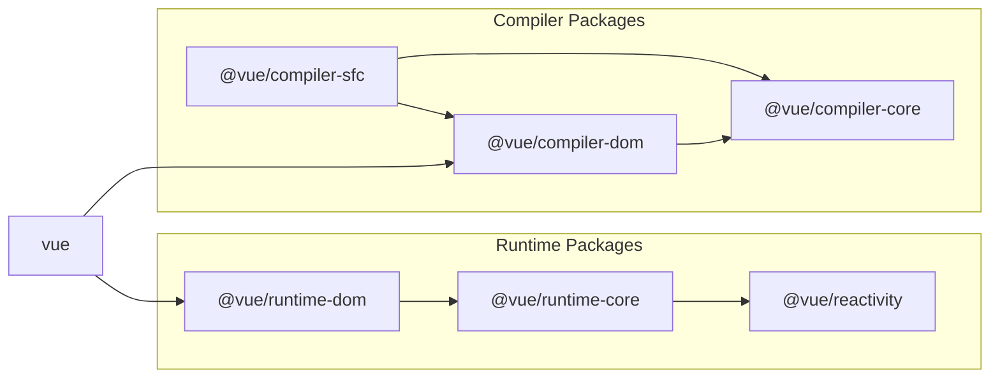

# 實現 SFC 解析器

## 準備工作

雖然這是我們之前創建的範例外掛程式，但讓我們刪除它，因為它不再需要了。

```sh
pwd # ~
rm -rf ./plugin-sample
```

另外，為了創建 Vite 外掛程式，請安裝主要的 Vite 套件。

```sh
pwd # ~
ni vite
```

這是外掛程式的主要部分，但由於這原本超出了 vuejs/core 的範圍，我們將在 `packages` 目錄中創建一個名為 `@extensions` 的目錄並在那裡實現它。

```sh
pwd # ~
mkdir -p packages/@extensions/vite-plugin-chibivue
touch packages/@extensions/vite-plugin-chibivue/index.ts
```

`~/packages/@extensions/vite-plugin-chibivue/index.ts`

```ts
import type { Plugin } from 'vite'

export default function vitePluginChibivue(): Plugin {
  return {
    name: 'vite:chibivue',

    transform(code, id) {
      return { code }
    },
  }
}
```

現在，讓我們實現 SFC 編譯器。\
但是，沒有任何實質內容可能很難想像，所以讓我們實現一個遊樂場並在執行時進行。\
我們將創建一個簡單的 SFC 並載入它。

```sh
pwd # ~
touch examples/playground/src/App.vue
```

`examples/playground/src/App.vue`

```vue
<script>
import { reactive } from 'chibivue'
export default {
  setup() {
    const state = reactive({ message: 'Hello, chibivue!', input: '' })

    const changeMessage = () => {
      state.message += '!'
    }

    const handleInput = e => {
      state.input = e.target?.value ?? ''
    }

    return { state, changeMessage, handleInput }
  },
}
</script>

<template>
  <div class="container" style="text-align: center">
    <h2>{{ state.message }}</h2>
    
    <p><b>chibivue</b> is the minimal Vue.js</p>

    <button @click="changeMessage">click me!</button>

    <br />

    <label>
      Input Data
      <input @input="handleInput" />
    </label>

    <p>input value: {{ state.input }}</p>
  </div>
</template>

<style>
.container {
  height: 100vh;
  padding: 16px;
  background-color: #becdbe;
  color: #2c3e50;
}
</style>
```

`playground/src/main.ts`

```ts
import { createApp } from 'chibivue'
import App from './App.vue'

const app = createApp(App)

app.mount('#app')
```

`playground/vite.config.js`

```ts
import path from 'node:path'
import { fileURLToPath } from 'node:url'
import { defineConfig } from 'vite'

import chibivue from '../../packages/@extensions/vite-plugin-chibivue'

const dirname = path.dirname(fileURLToPath(new URL(import.meta.url)))

export default defineConfig({
  resolve: {
    alias: {
      chibivue: path.resolve(dirname, '../../packages'),
    },
  },
  plugins: [chibivue()],
})
```

讓我們嘗試在這種狀態下啟動。


當然，這會導致錯誤。做得好（？）。

## 解決錯誤

讓我們暫時解決錯誤。我們不會立即追求完美。\
首先，讓我們將 `transform` 的目標限制為 "\*.vue"。\
我們可以像在範例中那樣使用 `id` 編寫分支語句，但由於 Vite 提供了一個名為 `createFilter` 的函式，讓我們使用它創建一個過濾器。\
（這沒有特別的原因。）

`~/packages/@extensions/vite-plugin-chibivue/index.ts`

```ts
import type { Plugin } from 'vite'
import { createFilter } from 'vite'

export default function vitePluginChibivue(): Plugin {
  const filter = createFilter(/\.vue$/)

  return {
    name: 'vite:chibivue',

    transform(code, id) {
      if (!filter(id)) return
      return { code: `export default {}` }
    },
  }
}
```

我們創建了一個過濾器，如果是 Vue 檔案，則將檔案內容轉換為 `export default {}`。\
錯誤應該消失，螢幕應該不顯示任何內容。

## 在 compiler-sfc 上實現解析器

現在，這只是一個臨時解決方案，所以讓我們實現一個合適的解決方案。\
vite-plugin 的作用是使用 Vite 啟用轉換，所以解析和編譯在主 Vue 套件中。\
那就是 `compiler-sfc` 目錄。



https://github.com/vuejs/core/blob/main/.github/contributing.md#package-dependencies

SFC 編譯器對於 Vite 和 Webpack 都是相同的。\
核心實現在 `compiler-sfc` 中。

讓我們創建 `compiler-sfc`。

```sh
pwd # ~
mkdir packages/compiler-sfc
touch packages/compiler-sfc/index.ts
```

在 SFC 編譯中，SFC 由一個名為 `SFCDescriptor` 的物件表示。

```sh
touch packages/compiler-sfc/parse.ts
```

`packages/compiler-sfc/parse.ts`

```ts
import { SourceLocation } from '../compiler-core'

export interface SFCDescriptor {
  id: string
  filename: string
  source: string
  template: SFCTemplateBlock | null
  script: SFCScriptBlock | null
  styles: SFCStyleBlock[]
}

export interface SFCBlock {
  type: string
  content: string
  loc: SourceLocation
}

export interface SFCTemplateBlock extends SFCBlock {
  type: 'template'
}

export interface SFCScriptBlock extends SFCBlock {
  type: 'script'
}

export declare interface SFCStyleBlock extends SFCBlock {
  type: 'style'
}
```

嗯，沒有什麼特別困難的。\
它只是一個表示 SFC 資訊的物件。

在 `packages/compiler-sfc/parse.ts` 中，我們將把 SFC 檔案（字串）解析為 `SFCDescriptor`。\
你們中的一些人可能在想，「什麼？你在模板解析器上如此努力工作，現在你要創建另一個解析器...？這很麻煩。」但不要擔心。\
我們在這裡要實現的解析器並不是什麼大事。那是因為我們只是通過結合我們迄今為止創建的內容來分離模板、腳本和樣式。

首先，作為準備，匯出我們之前創建的模板解析器。

`~/packages/compiler-dom/index.ts`

```ts
import { baseCompile, baseParse } from '../compiler-core'

export function compile(template: string) {
  return baseCompile(template)
}

// 匯出解析器
export function parse(template: string) {
  return baseParse(template)
}
```

在 compiler-sfc 端保留這些介面。

```sh
pwd # ~
touch packages/compiler-sfc/compileTemplate.ts
```

`~/packages/compiler-sfc/compileTemplate.ts`

```ts
import { TemplateChildNode } from '../compiler-core'

export interface TemplateCompiler {
  compile(template: string): string
  parse(template: string): { children: TemplateChildNode[] }
}
```

然後，只需實現解析器。

`packages/compiler-sfc/parse.ts`

```ts
import { ElementNode, NodeTypes, SourceLocation } from '../compiler-core'
import * as CompilerDOM from '../compiler-dom'
import { TemplateCompiler } from './compileTemplate'

export interface SFCParseOptions {
  filename?: string
  sourceRoot?: string
  compiler?: TemplateCompiler
}

export interface SFCParseResult {
  descriptor: SFCDescriptor
}

export const DEFAULT_FILENAME = 'anonymous.vue'

export function parse(
  source: string,
  { filename = DEFAULT_FILENAME, compiler = CompilerDOM }: SFCParseOptions = {},
): SFCParseResult {
  const descriptor: SFCDescriptor = {
    id: undefined!,
    filename,
    source,
    template: null,
    script: null,
    styles: [],
  }

  const ast = compiler.parse(source)
  ast.children.forEach(node => {
    if (node.type !== NodeTypes.ELEMENT) return

    switch (node.tag) {
      case 'template': {
        descriptor.template = createBlock(node, source) as SFCTemplateBlock
        break
      }
      case 'script': {
        const scriptBlock = createBlock(node, source) as SFCScriptBlock
        descriptor.script = scriptBlock
        break
      }
      case 'style': {
        descriptor.styles.push(createBlock(node, source) as SFCStyleBlock)
        break
      }
      default: {
        break
      }
    }
  })

  return { descriptor }
}

function createBlock(node: ElementNode, source: string): SFCBlock {
  const type = node.tag

  let { start, end } = node.loc
  start = node.children[0].loc.start
  end = node.children[node.children.length - 1].loc.end
  const content = source.slice(start.offset, end.offset)

  const loc = { source: content, start, end }
  const block: SFCBlock = { type, content, loc }

  return block
}
```

我認為對於到目前為止已經實現了解析器的每個人來說都很容易。讓我們在外掛程式中實際解析 SFC。

`~/packages/@extensions/vite-plugin-chibivue/index.ts`

```ts
import { parse } from '../../compiler-sfc'

export default function vitePluginChibivue(): Plugin {
  //.
  //.
  //.
  return {
    //.
    //.
    //.
    transform(code, id) {
      if (!filter(id)) return
      const { descriptor } = parse(code, { filename: id })
      console.log(
        '🚀 ~ file: index.ts:14 ~ transform ~ descriptor:',
        descriptor,
      )
      return { code: `export default {}` }
    },
  }
}
```

這段程式碼在 Vite 執行的程序中執行，這意味著它在 Node 中執行，所以我認為控制台輸出會顯示在終端中。


/_ 為簡潔起見省略 _/


看起來解析成功了。做得好！

到此為止的原始碼：
[chibivue (GitHub)](https://github.com/chibivue-land/chibivue/tree/main/book/impls/10_minimum_example/070_sfc_compiler2)
