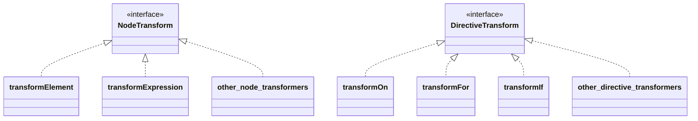

# 轉換器和程式碼生成重構的實現（基礎模板編譯器部門開始）

## 現有實現的回顧

現在，讓我們從最小示例部門停下的地方開始更認真地實現模板編譯器．距離我們上次處理它已經有一段時間了，所以讓我們回顧一下當前的實現．主要關鍵詞是 Parse，AST 和 Codegen．


```ts
export function baseCompile(
  template: string,
  option: Required<CompilerOptions>,
) {
  const ast = baseParse(template.trim())
  const code = generate(ast, option)
  return code
}
```

實際上，這個配置與原始配置略有不同．讓我們看看原始程式碼．

https://github.com/vuejs/core/blob/37a14a5dae9999bbe684c6de400afc63658ffe90/packages/compiler-core/src/compile.ts#L61

你能理解嗎...？

```ts
export function baseCompile(
  template: string,
  option: Required<CompilerOptions>,
) {
  const ast = baseParse(template.trim())
  transform(ast)
  const code = generate(ast, option)
  return code
}
```

就是這樣．

這次，我們將實現 `transform` 函式．


## 什麼是 Transform？

正如你從上面的程式碼中可以想像的那樣，透過解析獲得的 AST 被 `transform` 函式以某種方式轉換．

你可以透過閱讀這個來了解．  
https://github.com/vuejs/core/blob/37a14a5dae9999bbe684c6de400afc63658ffe90/packages/compiler-core/src/ast.ts#L43C1-L51C23

這個 VNODE_CALL 和以 JS 開頭的名稱的 AST 程式碼是我們這次要處理的．
Vue.js 的模板編譯器分為兩部分：表示解析模板結果的 AST 和表示生成程式碼的 AST．
我們當前的實現只處理前一個 AST．

讓我們考慮將模板 `<p>hello</p>` 作為輸入的情況．

首先，透過解析生成以下 AST．這與現有實現相同．

```ts
interface ElementNode {
  tag: string
  props: object /** 省略 */
  children: (ElementNode | TextNode | InterpolationNode)[]
}

interface TextNode {
  content: string
}
```

```json
{
  "tag": "p",
  "props": {},
  "children": [{ "content": "hello" }]
}
```

至於"表示生成程式碼的 AST"，讓我們考慮應該生成什麼樣的程式碼．
我認為應該是這樣的：

```ts
h('p', {}, ['hello'])
```

這是表示生成的 JavaScript 程式碼的 AST．
換句話說，它是一個表示用於生成應該生成的程式碼的 AST 的物件．

```ts
interface VNodeCall {
  tag: string
  props: PropsExpression
  children:
    | TemplateChildNode[] // multiple children
    | TemplateTextChildNode // single text child
    | undefined
}

type PropsExpression = ObjectExpression | CallExpression | ExpressionNode
type TemplateChildNode = ElementNode | InterpolationNode | TextNode
```

```json
{
  "tag": "p",
  "props": {
    "type": "ObjectExpression",
    "properties": []
  },
  "children": { "content": "hello" }
}
```

透過這種方式，表示由 Codegen 生成的程式碼的 AST 被表達．
你可能在這一點上感覺不到分離它們的必要性，但在將來實現指令時會很有用．
透過分離專注於輸入的 AST 和專注於輸出的 AST，我們可以使用稱為 `transform` 的函式執行從 `input AST -> output AST` 的轉換．

## Codegen 節點

現在我們已經掌握了流程，讓我們確認我們將處理什麼樣的節點（我們想要轉換什麼樣的節點）．我將在枚舉它們並提供註釋的同時進行解釋．請參考原始碼獲取準確資訊，因為某些部分被省略了．

```ts
export interface SimpleExpressionNode extends Node {
  type: NodeTypes.SIMPLE_EXPRESSION
  content: string
  isStatic: boolean
  identifiers?: string[]
}

// 這表示呼叫 h 函式的表達式。
// 它假設類似 `h("p", { class: 'message'}, ["hello"])` 的東西。
export interface VNodeCall extends Node {
  type: NodeTypes.VNODE_CALL
  tag: string | symbol
  props: ObjectExpression | undefined // 注意：在原始碼中實現為 PropsExpression（用於未來擴展）
  children:
    | TemplateChildNode[] // multiple children
    | TemplateTextChildNode
    | undefined
}

export type JSChildNode =
  | VNodeCall
  | ObjectExpression
  | ArrayExpression
  | ExpressionNode

// 這表示一個 JavaScript 物件。它用於 VNodeCall 的 props 等。
export interface ObjectExpression extends Node {
  type: NodeTypes.JS_OBJECT_EXPRESSION
  properties: Array<Property>
}
export interface Property extends Node {
  type: NodeTypes.JS_PROPERTY
  key: ExpressionNode
  value: JSChildNode
}

// 這表示一個 JavaScript 陣列。它用於 VNodeCall 的 children 等。
export interface ArrayExpression extends Node {
  type: NodeTypes.JS_ARRAY_EXPRESSION
  elements: Array<string | Node>
}
```

## 轉換器設計

在實現轉換器之前，讓我們談談設計．首先，重要的是要注意有兩種類型的轉換器：NodeTransform 和 DirectiveTransform．這些分別用於轉換節點和指令，並採用以下介面．

```ts
export type NodeTransform = (
  node: RootNode | TemplateChildNode,
  context: TransformContext,
) => void | (() => void) | (() => void)[]

// TODO:
// export type DirectiveTransform = (
//   dir: DirectiveNode,
//   node: ElementNode,
//   context: TransformContext,
// ) => DirectiveTransformResult;
export type DirectiveTransform = Function
```

DirectiveTransform 將在實現指令時在後面的章節中介紹，所以現在讓我們稱之為 Function．
NodeTransform 和 DirectiveTransform 實際上都是函式．你可以將它們視為轉換 AST 的函式．
請注意，NodeTransform 的結果是一個函式．在實現 transform 時，如果你實現它返回一個函式，該函式將在該節點的轉換之後執行（它被稱為 onExit 過程）．
你想在節點的 transform 之後執行的任何處理都應該在這裡描述．我將在稍後描述稱為 traverseNode 的函式時解釋這一點．
介面的解釋主要如上所述．

作為更具體的實現，有用於轉換元素的 transformElement 和用於轉換表達式的 transformExpression 等．
至於 DirectiveTransform 的實現，每個指令都有實現．
這些實現在 compiler-core/src/transforms 中實現．具體的轉換過程在這裡實現．

https://github.com/vuejs/core/tree/37a14a5dae9999bbe684c6de400afc63658ffe90/packages/compiler-core/src/transforms

圖像 ↓



接下來，關於上下文，TransformContext 保存在這些轉換期間使用的資訊和函式．
將來會添加更多，但現在這就足夠了．

```ts
export interface TransformContext extends Required<TransformOptions> {
  currentNode: RootNode | TemplateChildNode | null
  parent: ParentNode | null
  childIndex: number
}
```

## 轉換器的實現

現在讓我們在實踐中看看 transform 函式．首先，讓我們從獨立於每個轉換過程內容的框架的一般解釋開始．

結構非常簡單，只需生成上下文並使用 traverseNode 函式遍歷節點．
這個 traverseNode 函式是轉換的主要實現．

```ts
export function transform(root: RootNode, options: TransformOptions) {
  const context = createTransformContext(root, options)
  traverseNode(root, context)
}
```

在 traverseNode 中，基本上，它只是將保存在上下文中的 nodeTransforms（轉換節點的函式集合）應用於節點．
對於那些有子節點的，子節點也透過 traverseNode 傳遞．
在介面解釋期間提到的 onExit 的實現也在這裡．

```ts
export function traverseNode(
  node: RootNode | TemplateChildNode,
  context: TransformContext,
) {
  context.currentNode = node

  const { nodeTransforms } = context
  const exitFns = [] // 轉換後要執行的操作
  for (let i = 0; i < nodeTransforms.length; i++) {
    const onExit = nodeTransforms[i](node, context)

    // 註冊轉換後要執行的操作
    if (onExit) {
      if (isArray(onExit)) {
        exitFns.push(...onExit)
      } else {
        exitFns.push(onExit)
      }
    }
    if (!context.currentNode) {
      return
    } else {
      node = context.currentNode
    }
  }

  switch (node.type) {
    case NodeTypes.INTERPOLATION:
      break
    case NodeTypes.ELEMENT:
    case NodeTypes.ROOT:
      traverseChildren(node, context)
      break
  }

  context.currentNode = node

  // 執行轉換後要執行的操作
  let i = exitFns.length
  while (i--) {
    exitFns[i]() // 可以假設轉換已完成而執行的操作
  }
}

export function traverseChildren(
  parent: ParentNode,
  context: TransformContext,
) {
  for (let i = 0; i < parent.children.length; i++) {
    const child = parent.children[i]
    if (isString(child)) continue
    context.parent = parent
    context.childIndex = i
    traverseNode(child, context)
  }
}
```

接下來，讓我們談談具體的轉換過程．作為示例，讓我們實現 transformElement．

在 transformElement 中，我們主要將類型為 NodeTypes.ELEMENT 的節點轉換為 VNodeCall．

```ts
export interface ElementNode extends Node {
  type: NodeTypes.ELEMENT
  tag: string
  props: Array<AttributeNode | DirectiveNode>
  children: TemplateChildNode[]
  isSelfClosing: boolean
  codegenNode: VNodeCall | SimpleExpressionNode | undefined
}

// ↓↓↓↓↓↓ 轉換 ↓↓↓↓↓↓ //

export interface VNodeCall extends Node {
  type: NodeTypes.VNODE_CALL
  tag: string | symbol
  props: PropsExpression | undefined
  children:
    | TemplateChildNode[] // multiple children
    | TemplateTextChildNode
    | undefined
}
```

這是一個簡單的物件到物件的轉換，所以我認為不會很困難．讓我們嘗試透過閱讀原始碼來實現它．
我將貼上我這次假設的程式碼以防萬一．（指令支援將在另一章中完成．）

```ts
export const transformElement: NodeTransform = (node, context) => {
  return function postTransformElement() {
    node = context.currentNode!

    if (node.type !== NodeTypes.ELEMENT) return

    const { tag, props } = node

    const vnodeTag = `"${tag}"`
    let vnodeProps: VNodeCall['props']
    let vnodeChildren: VNodeCall['children']

    // props
    if (props.length > 0) {
      const propsBuildResult = buildProps(node)
      vnodeProps = propsBuildResult.props
    }

    // children
    if (node.children.length > 0) {
      if (node.children.length === 1) {
        const child = node.children[0]
        const type = child.type
        const hasDynamicTextChild = type === NodeTypes.INTERPOLATION

        if (hasDynamicTextChild || type === NodeTypes.TEXT) {
          vnodeChildren = child as TemplateTextChildNode
        } else {
          vnodeChildren = node.children
        }
      } else {
        vnodeChildren = node.children
      }
    }

    node.codegenNode = createVNodeCall(vnodeTag, vnodeProps, vnodeChildren)
  }
}

export function buildProps(node: ElementNode): {
  props: PropsExpression | undefined
  directives: DirectiveNode[]
} {
  const { props } = node
  let properties: ObjectExpression['properties'] = []
  const runtimeDirectives: DirectiveNode[] = []

  for (let i = 0; i < props.length; i++) {
    const prop = props[i]
    if (prop.type === NodeTypes.ATTRIBUTE) {
      const { name, value } = prop

      properties.push(
        createObjectProperty(
          createSimpleExpression(name, true),
          createSimpleExpression(value ? value.content : '', true),
        ),
      )
    } else {
      // directives
      // TODO:
    }
  }

  let propsExpression: PropsExpression | undefined = undefined
  if (properties.length) {
    propsExpression = createObjectExpression(properties)
  }

  return {
    props: propsExpression,
    directives: runtimeDirectives,
  }
}
```

## 基於轉換後的 AST 的程式碼生成

由於我們為 Codegen 轉換了 AST，我們也需要支援 Codegen．
對於進入 Codegen 的 AST，假設 VNodeClass（以及它們擁有的節點）編寫程式碼就足夠了．
期望的最終字串表示與以前相同．

現有的 Codegen 實現非常簡單，所以讓我們在這裡使它更正式一些（因為它相當硬編碼）．
讓我們也創建一個 Codegen 特定的上下文並將生成的程式碼推送到其中．
此外，讓我們在上下文中實現一些輔助函式（如縮排）．

```ts
export interface CodegenContext {
  source: string
  code: string
  indentLevel: number
  line: 1
  column: 1
  offset: 0
  push(code: string, node?: CodegenNode): void
  indent(): void
  deindent(withoutNewLine?: boolean): void
  newline(): void
}
```

我將在這裡省略實現細節，但我只是為每個角色分離了函式，實現方法沒有重大變化．
由於我還沒有能夠支援指令，由於在該區域刪除了臨時實現，有些部分不工作，但
如果程式碼大致按以下方式工作，就可以了！

```ts
import { createApp, defineComponent, ref } from 'chibivue'

const App = defineComponent({
  setup() {
    const count = ref(0)
    return { count }
  },

  template: `
    <div class="container">
      <p> Hello World! </p>
      <p> Count: {{ count }} </p>
    </div>
  `,
})

const app = createApp(App)

app.mount('#app')
```

到此為止的原始碼：
[chibivue (GitHub)](https://github.com/chibivue-land/chibivue/tree/main/book/impls/50_basic_template_compiler/010_transformer)
